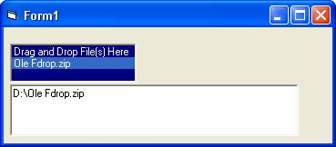



## An Ole File Drop Example

### Description

this is just a OLE file drop example very simple and easy to understand

drag and drop a file and select it from the list box. The name and path appears in the textbox upon selection
 
### More Info
 

             |
---                |---
**Submitted On**   |2007-06-22 15:30:12
**By**             |[William W](https://github.com/Planet-Source-Code/PSCIndex/blob/master/ByAuthor/william-w.md)
**Level**          |Beginner
**User Rating**    |5.0 (15 globes from 3 users)
**Compatibility**  |VB 5\.0, VB 6\.0
**Category**       |[OLE/ COM/ DCOM/ Active\-X](https://github.com/Planet-Source-Code/PSCIndex/blob/master/ByCategory/ole-com-dcom-active-x__1-29.md)
**World**          |[Visual Basic](https://github.com/Planet-Source-Code/PSCIndex/blob/master/ByWorld/visual-basic.md)
**Archive File**   |[Ole\_File\_D2072056222007\.zip](https://github.com/Planet-Source-Code/william-w-an-ole-file-drop-example__1-68867/archive/master.zip)

